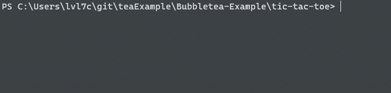

# Bubbletea-Example

## Learning Bubbletea CLI tools 

### Basics
```basics/``` follows posted tutorial at [github.com/charmbracelet/bubbletea/tree/master/tutorials/basics](https://www.github.com/charmbracelet/bubbletea/tree/master/tutorials/basics)

### Commands
```commands/``` follows posted tutorial at [github.com/charmbracelet/bubbletea/tree/master/tutorials/basics](https://www.github.com/charmbracelet/bubbletea/tree/master/tutorials/commands)

### Tic-Tac-Toe
```tic-tac-toe/``` is an original, arrow-key navigable tic-tac-toe game based on the foundational skills established in ```basics/```. Arrow keys and WASD navigate, spacebar and enter place game-pieces.




